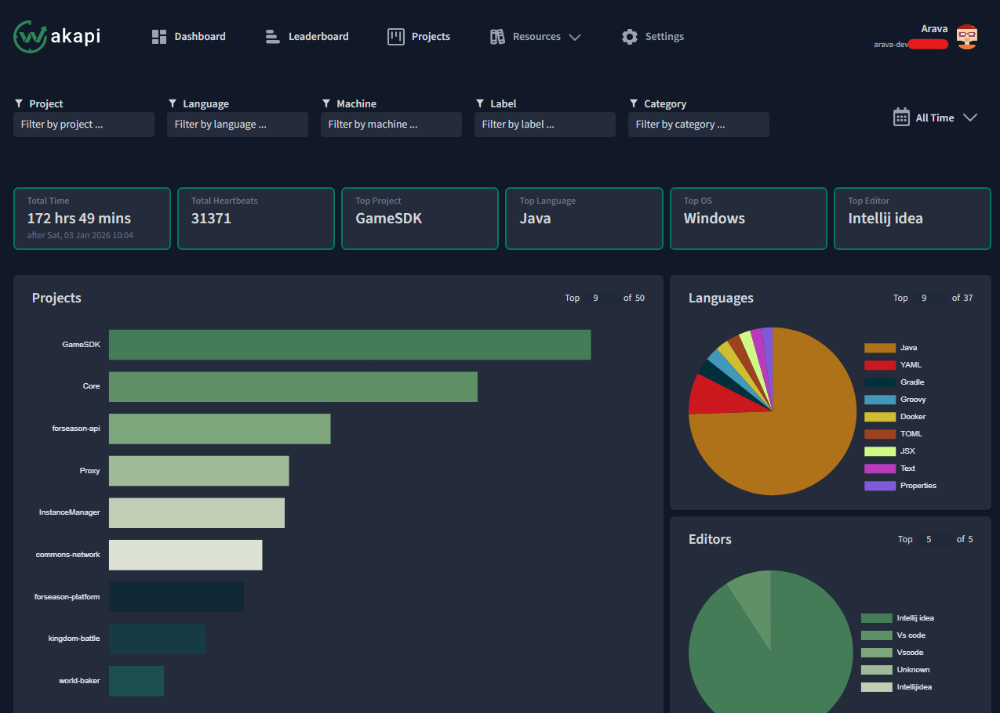

# Wakapi - Self-Hosted Coding Activity Tracker

[Francais](#fr---francais) | [English](#en---english)



---

## FR - Francais

### Presentation

Ce projet fournit une stack Docker **prete a l'emploi** pour deployer [Wakapi](https://github.com/muety/wakapi), une alternative open-source et auto-hebergee a [WakaTime](https://wakatime.com/).

Wakapi permet de **suivre automatiquement le temps passe a coder** dans votre editeur (VS Code, JetBrains, Vim, etc.) grace a des plugins WakaTime-compatibles. Les donnees sont stockees sur votre propre serveur, vous gardez le controle total sur vos metriques.

### Architecture

```
                  +-------------------+
  Editeur/IDE --> | Plugin WakaTime   |
                  +--------+----------+
                           |
                    API heartbeats
                           |
                  +--------v----------+
                  |   Wakapi (app)    |  Port 3000
                  +--------+----------+
                           |
                  +--------v----------+
                  |   PostgreSQL 16   |  Port 5432 (interne)
                  +-------------------+
```

- **Wakapi** : serveur web qui recoit les heartbeats et affiche les dashboards
- **PostgreSQL** : base de donnees pour stocker les heartbeats, projets, et statistiques
- Les deux services communiquent via un reseau Docker interne (`wakapi_net`)
- Seul le port de Wakapi est expose (`127.0.0.1:3000` par defaut), prevu pour etre derriere un reverse proxy (Nginx, Caddy, Traefik...)

### Prerequis

- [Docker](https://docs.docker.com/get-docker/) et [Docker Compose](https://docs.docker.com/compose/install/)
- `make` (optionnel, mais recommande)

### Installation

1. **Cloner le depot**
   ```bash
   git clone <url-du-repo>
   cd Wakapi
   ```

2. **Configurer l'environnement**
   ```bash
   cp .env.example .env
   ```
   Editez `.env` et modifiez au minimum :
   - `DB_PASSWORD` : un mot de passe fort pour PostgreSQL
   - `WAKAPI_PUBLIC_URL` : l'URL publique de votre instance (ex: `https://wakapi.mondomaine.fr`)
   - `WAKAPI_ALLOW_SIGNUP` : passez a `false` apres avoir cree votre compte

3. **Lancer la stack**
   ```bash
   make start
   ```

4. **Verifier que tout fonctionne**
   ```bash
   make health
   ```

5. **Configurer votre editeur**
   - Installez le plugin [WakaTime](https://wakatime.com/plugins) dans votre editeur
   - Dans les parametres du plugin, configurez l'URL de l'API vers votre instance :
     ```
     https://wakapi.mondomaine.fr/api
     ```
   - Renseignez votre cle API (disponible dans les parametres de votre compte Wakapi)

### Commandes Make

| Commande       | Description                                        |
|----------------|----------------------------------------------------|
| `make start`   | Demarrer la stack                                  |
| `make stop`    | Arreter la stack (sans supprimer les volumes)       |
| `make restart` | Redemarrer la stack                                |
| `make build`   | Rebuild et demarrer                                |
| `make pull`    | Telecharger les dernieres images                    |
| `make logs`    | Afficher les logs en temps reel                     |
| `make status`  | Afficher l'etat des conteneurs                      |
| `make delete`  | Reset complet (supprime conteneurs + volumes)       |
| `make app-shell` | Ouvrir un shell dans le conteneur Wakapi          |
| `make db-shell`  | Ouvrir un shell dans le conteneur PostgreSQL      |
| `make health`  | Verifier si l'application repond                    |
| `make help`    | Afficher toutes les commandes disponibles           |

### Variables d'environnement

Toutes les variables sont documentees dans [`.env.example`](.env.example). Les principales :

| Variable                | Description                                    | Defaut                     |
|-------------------------|------------------------------------------------|----------------------------|
| `WAKAPI_PUBLIC_URL`     | URL publique de l'instance                     | `https://wakapi.example.fr`|
| `WAKAPI_PORT`           | Port d'ecoute local                            | `3000`                     |
| `WAKAPI_ALLOW_SIGNUP`   | Autoriser la creation de comptes               | `true`                     |
| `WAKAPI_INSECURE_COOKIES` | Cookies non securises (`false` = HTTPS)      | `false`                    |
| `DB_PASSWORD`           | Mot de passe PostgreSQL                        | `CHANGE_ME_STRONG_PASSWORD`|
| `DB_TYPE`               | Type de base de donnees                        | `postgres`                 |
| `TZ`                    | Fuseau horaire                                 | `Europe/Paris`             |

### Reverse Proxy

L'application ecoute sur `127.0.0.1:3000`. Pour l'exposer en HTTPS, configurez un reverse proxy. Exemple avec **Nginx** :

```nginx
server {
    listen 443 ssl;
    server_name wakapi.mondomaine.fr;

    ssl_certificate     /path/to/cert.pem;
    ssl_certificate_key /path/to/key.pem;

    location / {
        proxy_pass http://127.0.0.1:3000;
        proxy_set_header Host $host;
        proxy_set_header X-Real-IP $remote_addr;
        proxy_set_header X-Forwarded-For $proxy_add_x_forwarded_for;
        proxy_set_header X-Forwarded-Proto $scheme;
    }
}
```

---

## EN - English

### Overview

This project provides a **ready-to-use** Docker stack to deploy [Wakapi](https://github.com/muety/wakapi), an open-source, self-hosted alternative to [WakaTime](https://wakatime.com/).

Wakapi **automatically tracks your coding time** in your editor (VS Code, JetBrains, Vim, etc.) using WakaTime-compatible plugins. All data is stored on your own server, giving you full control over your metrics.

### Architecture

```
                  +-------------------+
  Editor/IDE  --> | WakaTime Plugin   |
                  +--------+----------+
                           |
                    API heartbeats
                           |
                  +--------v----------+
                  |   Wakapi (app)    |  Port 3000
                  +--------+----------+
                           |
                  +--------v----------+
                  |   PostgreSQL 16   |  Port 5432 (internal)
                  +-------------------+
```

- **Wakapi**: web server that receives heartbeats and displays dashboards
- **PostgreSQL**: database storing heartbeats, projects, and statistics
- Both services communicate via an internal Docker network (`wakapi_net`)
- Only the Wakapi port is exposed (`127.0.0.1:3000` by default), designed to sit behind a reverse proxy (Nginx, Caddy, Traefik...)

### Prerequisites

- [Docker](https://docs.docker.com/get-docker/) and [Docker Compose](https://docs.docker.com/compose/install/)
- `make` (optional but recommended)

### Installation

1. **Clone the repository**
   ```bash
   git clone <repo-url>
   cd Wakapi
   ```

2. **Configure the environment**
   ```bash
   cp .env.example .env
   ```
   Edit `.env` and change at least:
   - `DB_PASSWORD`: a strong password for PostgreSQL
   - `WAKAPI_PUBLIC_URL`: the public URL of your instance (e.g. `https://wakapi.example.com`)
   - `WAKAPI_ALLOW_SIGNUP`: set to `false` after creating your account

3. **Start the stack**
   ```bash
   make start
   ```

4. **Verify everything is running**
   ```bash
   make health
   ```

5. **Configure your editor**
   - Install the [WakaTime](https://wakatime.com/plugins) plugin in your editor
   - In the plugin settings, set the API URL to your instance:
     ```
     https://wakapi.example.com/api
     ```
   - Enter your API key (available in your Wakapi account settings)

### Make Commands

| Command          | Description                                     |
|------------------|-------------------------------------------------|
| `make start`     | Start the stack                                 |
| `make stop`      | Stop the stack (without removing volumes)        |
| `make restart`   | Restart the stack                               |
| `make build`     | Rebuild and start                               |
| `make pull`      | Pull the latest images                          |
| `make logs`      | Show real-time logs                             |
| `make status`    | Show container status                           |
| `make delete`    | Full reset (removes containers + volumes)        |
| `make app-shell` | Open a shell in the Wakapi container            |
| `make db-shell`  | Open a shell in the PostgreSQL container         |
| `make health`    | Check if the application is responding           |
| `make help`      | Show all available commands                      |

### Environment Variables

All variables are documented in [`.env.example`](.env.example). Key variables:

| Variable                  | Description                               | Default                    |
|---------------------------|-------------------------------------------|----------------------------|
| `WAKAPI_PUBLIC_URL`       | Public URL of the instance                | `https://wakapi.example.fr`|
| `WAKAPI_PORT`             | Local listening port                      | `3000`                     |
| `WAKAPI_ALLOW_SIGNUP`     | Allow account creation                    | `true`                     |
| `WAKAPI_INSECURE_COOKIES` | Insecure cookies (`false` = HTTPS)        | `false`                    |
| `DB_PASSWORD`             | PostgreSQL password                       | `CHANGE_ME_STRONG_PASSWORD`|
| `DB_TYPE`                 | Database type                             | `postgres`                 |
| `TZ`                      | Timezone                                  | `Europe/Paris`             |

### Reverse Proxy

The application listens on `127.0.0.1:3000`. To expose it over HTTPS, set up a reverse proxy. Example with **Nginx**:

```nginx
server {
    listen 443 ssl;
    server_name wakapi.example.com;

    ssl_certificate     /path/to/cert.pem;
    ssl_certificate_key /path/to/key.pem;

    location / {
        proxy_pass http://127.0.0.1:3000;
        proxy_set_header Host $host;
        proxy_set_header X-Real-IP $remote_addr;
        proxy_set_header X-Forwarded-For $proxy_add_x_forwarded_for;
        proxy_set_header X-Forwarded-Proto $scheme;
    }
}
```

---

## License

[Wakapi](https://github.com/muety/wakapi) is developed by [muety](https://github.com/muety) and released under the MIT License.
